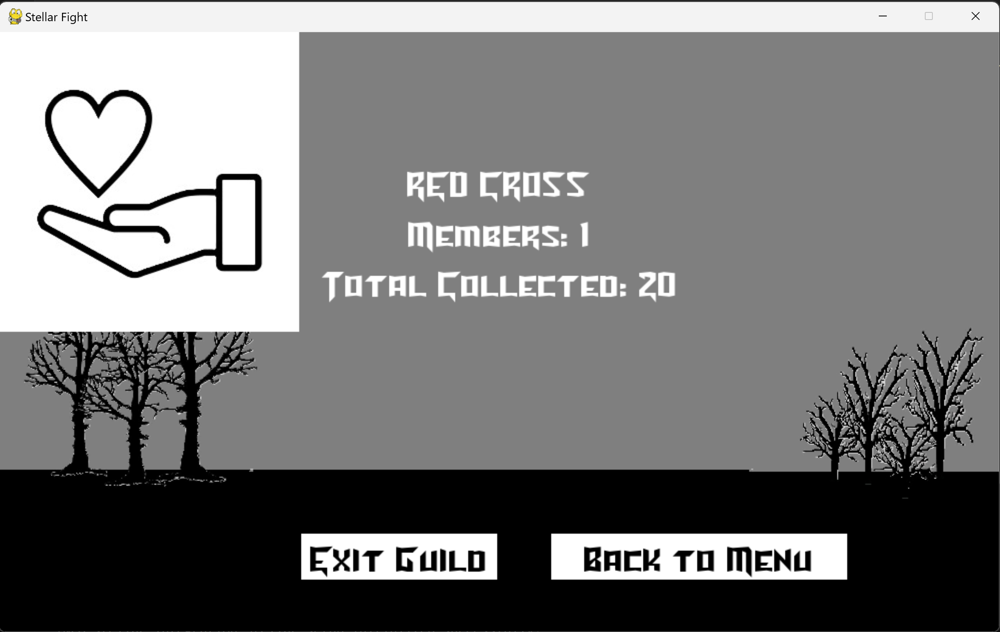
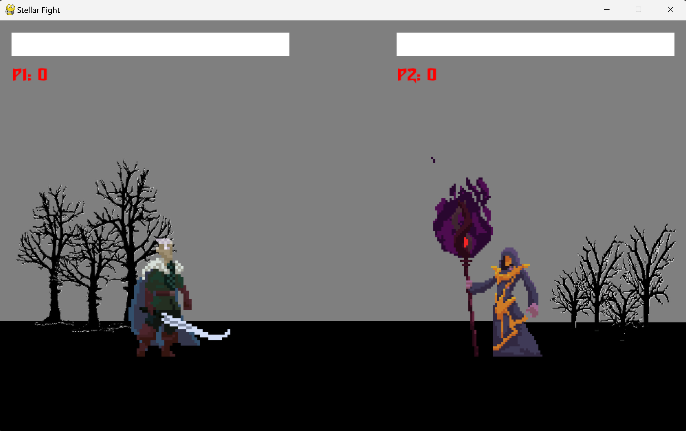

# Stellar Fight

Stellar Fight is an arcade-style, one-on-one fighting game with a blockchain twist. Players battle against each other in intense duels, and winners are rewarded with **StellarToken**, a custom asset built on the Stellar blockchain. As players win consecutive battles, they can earn streak bonuses, unlocking more tokens and donate to charities. This is a project idea from the EASYA x Stellar Meridian Hackathon, 12th to 13th October, 2024.

## Table of Contents
- [Features](#features)
- [Game Mechanics](#game-mechanics)
- [Stellar Integration](#stellar-integration)
- [Installation](#installation)
- [Usage](#usage)
- [Future Development](#future-development)
- [Pictures](#pictures)
- [Contributing](#contributing)
- [License](#license)

## Features
- **Arcade-Style Fighting**: Classic 1v1 duels reminiscent of old-school fighting games.
- **Stellar Blockchain Rewards**: Players earn StellarToken for winning matches, and more tokens for win streaks.
- **Guild System**: Players can join guilds (real-world charities) to gain minor gameplay buffs and display the charity's symbol.
- **Cosmetic Item Shop (In Progress)**: Spend StellarTokens on in-game cosmetics for a personalized experience.
- **Charity Donations (TestNet)**: Real-world charities benefit from player donations via StellarToken, which can be exchanged back into fiat currencies.

## Game Mechanics
- **Fight and Win Tokens**: Players engage in duels where the winner is rewarded with **StellarToken**.
- **Win Streaks**: Consecutive wins yield higher rewards, increasing token earnings.
- **Guild Buffs (In Progress)**: By joining a guild (charity), players pay a daily fee in StellarTokens and receive minor gameplay advantages, along with displaying the charity's logo next to their in-game name.
- **Cosmetic Store (In Progress)**: Players can use StellarTokens to purchase cosmetic items, creating a game economy that recirculates the in-game currency.

## Stellar Integration
- **StellarToken**: The in-game currency is a custom asset built on the Stellar network.
- **Real-World Value**: StellarTokens can be donated to real-world charities, and charities can convert the tokens back to fiat currencies.
- **Sponsors and Donations**: Game sponsorships and donations can help support charities through the StellarToken economy by investing the game.

## Installation
To get started with **Stellar Fight**, follow the steps below:

1. Clone the repository:
    ```bash
    git clone https://github.com/Shadow-Steinbjorn/Stellar-Fight.git
    ```
2. Navigate to the main project folder:
    ```bash
    cd Stellar-Fight/stellar_fighter
    ```
3. Install the required dependencies:
    ```bash
    pip install -r requirements.txt
    ```
4. Run the game:
    ```bash
    python main.py
    ```

## Usage
Once installed, run the game and start dueling to earn **StellarTokens**. Use your tokens to:
- **Join guilds (coming soon)** and support real-world charities while receiving gameplay perks.
- **Buy cosmetic items (Developing)** and personalize your in-game appearance.

## Future Development
- **Guild System Completion**: Implementing the guild system, allowing players to join charities and receive buffs.
- **Cosmetic Item Store**: Further development of the in-game shop for token-based cosmetic purchases.
- **Charity Partnerships**: Expanding partnerships with real-world charities for more robust token donation/exchange mechanisms.
- **Release into the MainNet**: Releasing the finished game into the public, opening the tokens to MainNet and (hopefully) releasing the game on STEAM for !!!FREE!!!.

## Pictures




## Contributing
We welcome contributions to help improve **Stellar Fight**! To contribute:

1. Fork the repository.
2. Create a new branch for your feature or bug fix:
    ```bash
    git checkout -b feature/YourFeatureName
    ```
3. Make your changes and commit:
    ```bash
    git commit -m "Add your feature or fix"
    ```
4. Push to your branch:
    ```bash
    git push origin feature/YourFeatureName
    ```
5. Open a pull request describing your changes.

## License
This project is licensed under the [MIT License](LICENSE).